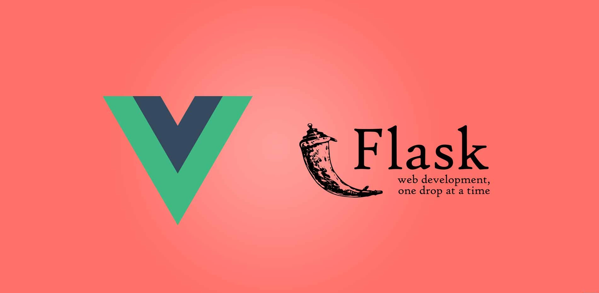

# Full stack app template

A ready-to-use and customizable web app template with VueJs for frontend and Flask for backend, running on https. Whether 
you are a beginner or an experienced developer, launch your app and start developing your first feature in 30 minutes!

## Table of Contents

<!--ts-->
   * [About the template](#about-the-template) 
        *  [Front end](#front-end)
        *  [Back end](#back-end)
        *  [Authentication](#authentication)
   * [Getting started](#getting-started) 
        *  [Requirements](#requirements)
<!--te-->

## About the template
### Front end
The front end runs on `https://localhost:8080`. It uses the v2 of the CSS library [Vuetify](https://vuetifyjs.com/en/). 
The landing page is the login page. Another template will be released soon for apps that don't necessarily require 
users to authenticate.

An authentication module is implemented, as well as a convenient global notification system to improve user experience.
The front end also contains a job module, to retrieve jobs from the backend and display their progress.  

    ├── front
            ├── public                                      # Config files
            │    ├── favicion.ico                           # App icon  
            │    └── index.html                             # Main html file
            ├── src                                         # Frontend main folder 
            │    ├── assets                                 # Media and fonts
            │    ├── components                             # Custom components files
            │    │    ├── auth                              # Auth components   
            │    │    │    ├── EmailLogin.vue               # Email login component
            │    │    │    ├── FacebookLogin.vue            # Facebook login component
            │    │    │    └── GoogleLogin.vue              # Google login component
            │    │    └── util                              # Util components
            │    │         ├── Header.vue                   # Header component
            │    │         └── Jobs.vue                     # Jobs component
            │    ├── modules                                # Useful modules
            │    │    ├── auth                              # Auth files
            │    │    │    ├── email.js                     # Email auth functions
            │    │    │    ├── facebook.js                  # Facebook auth functions
            │    │    │    ├── google.js                    # Google auth functions
            │    │    │    └── util.js                      # Common auth functions
            │    │    ├── jobs                              # Job store functions
            │    │    ├── notifications                     # Notification store function
            │    │    └── router                            # Vue router 
            │    ├── pages                                  # Pages of the app
            │    │    ├── auth                              # Auth pages
            │    │    │    ├── callback                     # Callback pages
            │    │    │    │    ├── FacebookCallback.vue    # Facebook auth callback page
            │    │    │    │    └── GoogleCallback.vue      # Google auth callback page
            │    │    │    └── Login.vue                    # Login page
            │    │    └── router                            # Vue router 
            │    ├── plugins                                # App plugins
            │    │    └── vuetify.js                        # Vuetify setup
            │    ├── App.vue                                # Vue app
            │    └── main.js                                # Create app
            ├── .env.development                            # Development environment
            ├── babel.config.js                             # Babel configuration
            ├── package.json                                # Packages and dependencies
            ├── package-lock.json                           # Packages and dependencies
            └── vue.config.js                               # Vue configuration
        
### Back end
The back end runs on `https://localhost:5000`. It uses docker containers to run an api, a worker (jobs are queued with 
[RQ](https://python-rq.org/)) and a scheduler. It contains the following:
* [PostgreSQL](https://www.postgresql.org/) database
* [Elasticsearch](https://www.elastic.co/start) database plugged with a [Kibana](https://www.elastic.co/products/kibana) 
interface
* [Minio](https://min.io/) storage 
* [Redis](https://redis.io/) cache
* Email module to send emails

Like the front end, it contains an authentication module, as well as a global customizable error handler.

    ├── back
        ├── config                              # Config files
        │    └── config.dev.json                # Development config
        ├── template                            # Backend main folder 
        │    ├── api                            # Routes registration
        │    │    ├── errors.py                 # Exceptions handler  
        │    │    └── jobs.py                   # Job retriever
        │    ├── auth                           # Auth files
        │    │    ├── email_login.py            # Email auth blueprint        
        │    │    ├── facebook_login.py         # Facebook auth blueprint
        │    │    └── google_login.py           # Google auth blueprint
        │    ├── core                           # Architecture files
        │    │    ├── cache.py                  # Redis cache
        │    │    ├── config.py                 # Config object
        │    │    ├── database.py               # PostgreSQL database
        │    │    ├── elasticsearch.py          # Elacticsearch database
        │    │    ├── mail.py                   # Email module
        │    │    └── storage.py                # Minio storage
        │    ├── exceptions                     # Customized exceptions
        │    ├── managers                       # Functions to interact with resources
        │    ├── models                         # Resources
        │    ├── storage                        # Storage blueprint
        │    ├── app.py                         # Create app
        │    └── config.py                      # JWT config
        ├── templates                           # Html templates for emails
        ├── DockerFile                          # Launch script
        ├── requirements.txt                    # Packages and dependencies
        ├── run.py                              # Run the app
        └── worker.py                           # Register the worker
        
### Authentication
No need to spend some precious time on authentication! The template contains a full built-in JWT module that allows three
types of authentication: email login, [Google OAuth 2.0 login](https://developers.google.com/identity/protocols/OAuth2)
and [Facebook OAuth 2.0 login](https://developers.facebook.com/docs/facebook-login/manually-build-a-login-flow). We will 
see how to quickly [set up the module](#set-up-authentication-module) with your own credentials for Google and Facebook
logins.

## Getting started
### Requirements

