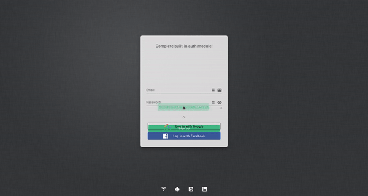

# Full stack app template

A ready-to-use and customizable web app template with VueJs for frontend and Flask for backend, running on https. Whether 
you are a beginner or an experienced developer, launch your app and start developing your first feature in 30 minutes!

## Table of Contents

<!--ts-->
   * [About the template](#about-the-template) 
        *  [Front end](#front-end)
        *  [Back end](#back-end)
        *  [Authentication](#authentication)
<!--te-->

## About the template
### Front end
The front end runs on `https://localhost:8080`. It uses the v2 of the CSS library [Vuetify](https://vuetifyjs.com/en/). 
The landing page is the login page. Another template will be released soon for apps that don't necessarily require 
users to authenticate.

An authentication module is implemented, as well as a convenient global notification system to improve user experience.
The front end also contains a job module, to retrieve jobs from the backend and display their progress.  

### Back end
The back end runs on `https://localhost:5000`. It uses docker containers to run an api, a worker (jobs are queued with 
[RQ](https://python-rq.org/)) and a scheduler. It contains the following:
* [PostgreSQL](https://www.postgresql.org/) database
* [Elasticsearch](https://www.elastic.co/start) database plugged with a [Kibana](https://www.elastic.co/products/kibana) 
interface
* [Minio](https://min.io/) storage 
* [Redis](https://redis.io/) cache
* Email module to send emails

Like the front end, it contains an authentication module, as well as a global customizable error handler.

### Authentication
No need to spend some precious time on authentication! The template contains a full built-in module, to allow three
types of authentication: email login, [Google OAuth 2.0 login](https://developers.google.com/identity/protocols/OAuth2)
and [Facebook OAuth 2.0 login](https://developers.facebook.com/docs/facebook-login/manually-build-a-login-flow). We will 
see how to quickly [set up the module](#set-up-authentication-module) with your own credentials for Google and Facebook
logins.

